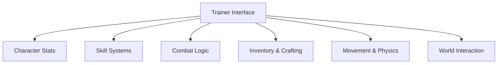

## Overview

Project: Gorgon Trainer is a runtime gameplay control utility designed to interface with complex MMORPG systems inside **Project: Gorgon**. The trainer exposes adjustable parameters for character attributes, skill progression, combat resolution, inventory logic, and environmental interaction. Operating through non-destructive runtime hooks, it enables controlled modification of simulation variables without altering persistent world data. Secondary keywords integrated include MMORPG trainer, stat controller, skill progression modifier, and sandbox system utility.

---

## Character Attributes and Vital Stats Control

* Health, power, and endurance locking
* Damage intake scaling
* Regeneration rate adjustment
* Status effect suppression

**Feature intent:**
Intercepts character stat calculations to regulate survivability and resource flow during combat and exploration.

---

## Skill and Ability Progression Manager

* Skill experience multiplier
* Ability unlock bypass
* Cooldown reduction control
* Skill requirement override

**In-game behavior:**
Modifies progression checks tied to skill usage, leveling, and ability gating.

---

## Combat Logic and Enemy Interaction Layer

* Damage output scaling
* Enemy aggression range adjustment
* Hit chance and evasion tuning
* Combat timer manipulation

**Feature intent:**
Alters combat resolution logic affecting hit calculations, threat generation, and encounter pacing.

---

## Inventory, Crafting, and Resource Control

* Item quantity manipulation
* Crafting material requirement bypass
* Tool durability lock
* Resource consumption override

**In-game behavior:**
Overrides inventory validation and crafting checks across professions and production systems.

---

## Movement, Stamina, and Physics Overrides

* Movement speed multiplier
* Stamina usage suppression
* Jump and fall behavior tuning
* Terrain collision adjustment

**Feature intent:**
Applies physics-layer overrides to traversal mechanics and endurance-based movement.

---

## World Interaction and NPC Systems

* NPC interaction distance expansion
* Vendor stock unlock
* Dialogue and event trigger control
* World object interaction bypass

**In-game behavior:**
Manages interaction validation logic for NPCs, vendors, and environmental objects.

---

## Trainer Interface and Session Configuration

* Categorized system modules
* Toggle-based activation
* Real-time value sliders
* Session-scoped configuration storage

**Feature intent:**
Acts as the central coordination layer, synchronizing all trainer subsystems dynamically during active play.

---

## System Architecture Diagram

---

## FAQ

**Does the trainer modify persistent character data?**
No, all changes are applied at runtime only.

**Can skill progression be adjusted independently?**
Yes, skill-related features function as standalone modules.

**Are combat changes applied immediately?**
Most combat and stat adjustments take effect in real time.

**Does it affect other players?**
The trainer interfaces with local runtime systems.

**Can inventory changes be reversed?**
Disabling inventory features restores default behavior.

**Is configuration saved between sessions?**
Settings apply per active session only.

---

## Feature Summary

* Character attributes and vital stats control
* Skill and ability progression management
* Combat logic and enemy interaction layer
* Inventory, crafting, and resource control
* Movement, stamina, and physics overrides
* World interaction and NPC systems
* Centralized Project: Gorgon trainer interface
